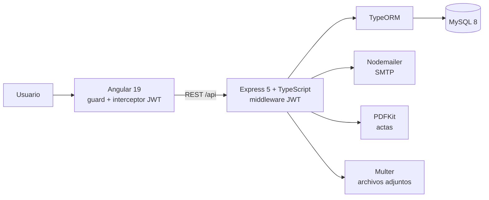

# Sistema de Administración de Juntas Directivas

Aplicación web full-stack para organizar el ciclo completo de las sesiones de una junta directiva: convocar la sesión, armar la agenda, registrar asistencia, tomar decisiones y tareas durante la reunión, y generar el acta en PDF al terminar.

Proyecto de equipo (Grupo 2).

**Stack:** Angular 19 · Angular Material · TypeScript · Node.js · Express 5 · TypeORM · MySQL 8 · JWT · Docker

---

## Qué hace

**Gestión de sesiones**
- Crear, editar y listar sesiones con modalidad, fecha y horario.
- Enviar la convocatoria por correo a los participantes (Nodemailer).
- Ejecutar la sesión: marcar asistencia, cambiar el estado de la sesión y registrar el resultado de las votaciones.
- Exportar el acta de la sesión en PDF (PDFKit).

**Agenda por tipo de punto**
Cada punto de agenda es de uno de tres tipos, y el tipo se decide según lo que incluye:

- **Informativo:** solo anotaciones.
- **Estratégico:** anotaciones, decisiones y tareas.
- **Aprobación:** punto que se somete a votación; el resultado queda como aprobado o rechazado.

Los puntos pueden tener expositor interno o invitado externo, y adjuntar archivos (Multer).

**Seguimiento**
- Tareas con responsable y estado, ligadas a un punto de agenda.
- Notificaciones por usuario (leer, borrar, limpiar) con plantillas para invitaciones y asignación de tareas.
- Módulo de consulta: sesiones en progreso, agendas editables, próximas sesiones, actas por expositor o responsable, y sesiones donde un miembro estuvo ausente.

**Usuarios y configuración**
- Login con JWT y contraseñas con hash (bcrypt).
- Dos perfiles: administrador y miembro de junta, con vistas distintas.
- Parámetros del sistema configurables desde la interfaz.

---

## Arquitectura



### Patrones de diseño aplicados

| Patrón | Dónde | Para qué |
|---|---|---|
| Factory | `utils/AgendaItemFactory.ts` | Crear el tipo correcto de punto de agenda según lo que incluye |
| Visitor | `visitor/` | Filtrar sesiones y actas por ausencia, expositor o responsable sin llenar las entidades de lógica de consulta |
| Adapter | `utils/UserJDAdapter.ts` | Tratar a un miembro de junta como un usuario del sistema con una interfaz común |
| Singleton | `AuthController` | Una única instancia del controlador de autenticación |
| Herencia de tabla | `model/AgendaItem.ts` | Una sola tabla para los tres tipos de punto, separados por columna `type` |

---

## Estructura

```
backend/
  src/
    controller/   endpoints por módulo
    service/      consultas y notificaciones
    model/        entidades TypeORM
    routes/       rutas protegidas con JWT
    visitor/      patrón Visitor
    templates/    plantillas de notificación
    database/     data-source y dump SQL
frontend/
  src/app/
    auth/         login
    core/         guard, interceptor, modelos y servicios
    layout/       header y sidebar
    pages/        sessions, consultation, notifications, users, settings
```

---

## Cómo ejecutarlo

### Requisitos
Node.js 20 o superior, Docker (para MySQL) y una cuenta de Gmail con contraseña de aplicación si quieres probar el envío de correos.

### 1. Backend

```bash
cd backend
cp .env.example .env      # completa las variables
docker compose up -d      # MySQL en el puerto 3307 del host
npm install
npm run dev               # http://localhost:3000
```

Con Docker Compose, MySQL queda expuesto en el puerto **3307**, así que en tu `.env` usa `DB_PORT=3307`.

Las tablas se crean solas al iniciar (TypeORM con `synchronize`). También puedes restaurar la estructura desde `src/database/junta_directiva_dump.sql`.

### 2. Datos iniciales

El dump incluye la estructura pero no datos. Antes de usar la app hacen falta los catálogos que el código referencia por nombre:

```sql
INSERT INTO roles (name) VALUES ('Admin'), ('Miembro de Junta');
INSERT INTO session_statuses (name) VALUES ('Agendada'), ('En Progreso'), ('Finalizada');
```

Además se necesitan filas en `modalities` y `task_statuses` con los valores que quieras ofrecer en la interfaz. Después puedes crear el primer usuario con `POST /auth/register`.

### 3. Frontend

```bash
cd frontend
npm install
ng serve                  # http://localhost:4200
```

En desarrollo el frontend apunta a `http://localhost:3000`. La URL del backend de producción se define en `src/environments/environment.ts`.

### Variables de entorno

| Variable | Uso |
|---|---|
| `DB_HOST`, `DB_PORT`, `DB_USERNAME`, `DB_PASSWORD`, `DB_NAME` | Conexión a MySQL |
| `JWT_SECRET` | Clave para firmar los tokens |
| `EMAIL_USER`, `EMAIL_PASS` | Cuenta SMTP (Gmail) para convocatorias |
| `PORT` | Puerto del backend (por defecto 3000) |
| `MYSQL_*` | Credenciales con las que Docker crea la base de datos |

---

## API

Todas las rutas bajo `/api` requieren `Authorization: Bearer <token>`. Las de `/auth` son públicas.

| Módulo | Rutas principales |
|---|---|
| Auth | `POST /auth/login`, `POST /auth/register` |
| Sesiones | `GET/POST /api/sessions`, `PUT /api/sessions/:id`, `PUT /api/sessions/:id/status`, `POST /api/sessions/:id/send-invitation`, `GET /api/sessions/:id/export` |
| Ejecución | `GET /api/session/execution`, `GET /api/sessions/execution/:id/details`, `PUT /api/session-participants/:id/attendance`, `PUT /api/agenda-items/:id/vote-result` |
| Agenda | `POST /api/agenda-items`, tareas, notas y decisiones por punto (`/api/points/:pointId/...`) |
| Consulta | `/api/consultation/sessions/*`, `/api/consultation/actas/*` |
| Notificaciones | `/api/notifications/*` |
| Usuarios y ajustes | `/api/users`, `/api/roles`, `/api/modalities`, `/api/settings` |

---

## Notas de desarrollo

- `synchronize: true` en TypeORM es cómodo para desarrollo; para producción conviene pasar a migraciones.